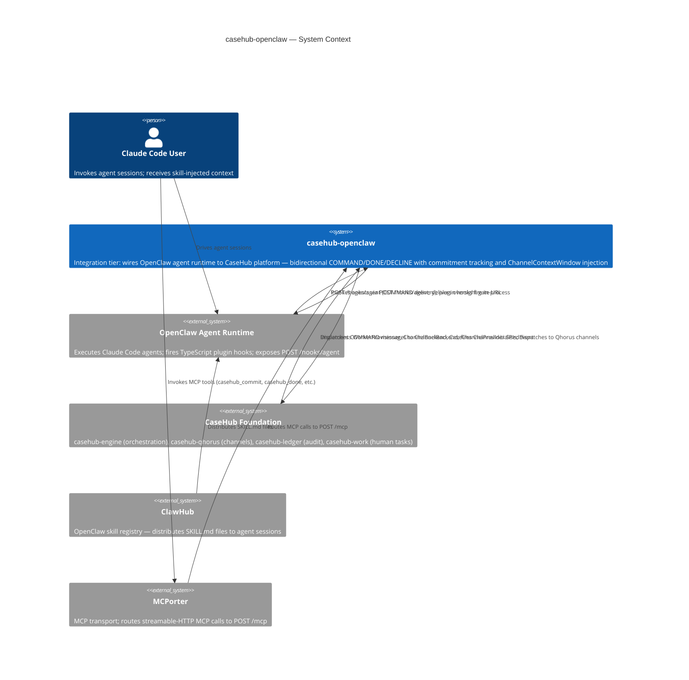

# casehub-openclaw — ARC42STORIES.MD

**Version:** 0.1 (initial)
**Date:** 2026-06-02
**Spec:** [Arc42Stories v0.1](../parent/docs/arc42stories-spec.md)
**Profile:** CaseHub — Integration tier (custom; not listed in CaseHub Profile application or foundation tier)
**Profile ref:** `../parent/docs/arc42stories-casehub-profile.md` · fallback: `https://raw.githubusercontent.com/casehubio/parent/main/docs/arc42stories-casehub-profile.md`
**Prefix:** OC
**Note:** casehub-openclaw is an integration tier component — it bridges Claude Code (OpenClaw) and the CaseHub platform. The CaseHub Foundation Layer Taxonomy (casehub-work → casehub-qhorus → casehub-ledger → casehub-engine) does not apply. Layer entries in §9.4 use a custom module-tier taxonomy (L1–L6). The CaseHub Profile §8 crosscutting conventions, artifact schema, and §3 platform references apply; the Default Layer Taxonomy does not.

---

## §1 Introduction and Goals

### Description

`casehub-openclaw` is the **integration tier** bridging the CaseHub platform and Claude Code (OpenClaw agent runtime). It wires bidirectional COMMAND/DONE/DECLINE accountability into OpenClaw agent sessions: CaseHub dispatches COMMAND messages; OpenClaw agents execute skills and return DONE or DECLINE; every agent action is tracked as a CaseHub commitment with an auditable outcome.

This is not an application layer and not a framework. It is the connector between two systems. CaseHub provides orchestration, accountability, and audit primitives. OpenClaw provides the agent runtime with its hook-based invocation model. casehub-openclaw makes OpenClaw agents first-class CaseHub workers.

Codebase: Java 21/Quarkus (`core/`, `casehub/`, `app/`), Python SDK (`python/`), TypeScript plugin (`plugin/`), OpenClaw SKILL.md files (`skills/`).

### Stakeholders

| Stakeholder | Interest |
|---|---|
| Claude Code users | Agent sessions receive CaseHub skill injection; commitment tracking is automatic |
| CaseHub platform | Dispatches COMMAND messages to OpenClaw agents; receives DONE/DECLINE back on Qhorus channels |
| Skill authors | Publish SKILL.md files to ClawHub; casehub-openclaw provides the MCP tool surface skills invoke |
| Platform team | Validates the integration-tier pattern for future non-OpenClaw agent runtimes |

### Quality Goals

| Priority | Goal | Scenario |
|---|---|---|
| 1 | Every agent action observable in CaseHub | Qhorus channel activity is injected into agent context before each turn via ChannelContextWindow |
| 2 | COMMAND→DONE/DECLINE round trip accountable | Agent outputs land on Qhorus work channels; Watchdog fires if the agent goes silent |
| 3 | Human oversight gate for consequential actions | `ActionRiskClassifier` can interrupt the return path; human RESPONSE resumes or declines the case step |
| 4 | MCP tool surface for direct CaseHub invocation | 9 MCP tools expose commitment lifecycle without requiring agent context of Qhorus internals |

### Artifact Schema

PREFIX: `OC`

| Artifact type | Format | Example | Where it lives |
|---|---|---|---|
| Improvement log | `OC-NNN` | `OC-042` | `docs/PROGRESS.md` (not yet created) |
| Issue | `#NNN` or `casehubio/openclaw#NNN` | `#16`, `casehubio/openclaw#16` | GitHub Issues |
| Garden entry | `GE-YYYYMMDD-XXXXXX` | `GE-20260601-85afd0` | `~/.hortora/garden/` |
| Protocol | `PP-YYYYMMDD-XXXXXX` | `PP-20260531-43de8e` | `casehub-parent/docs/protocols/` |
| ADR | `ADR-NNNN` | `ADR-0002` | `docs/adr/` |
| Blog entry | `YYYY-MM-DD-[initials]NN-title` | `2026-05-31-mdp01-openclaw-skill-pack` | workspace `blog/` |
| Design spec | `YYYY-MM-DD-topic-design` | `2026-05-30-epic6-bidirectional-wiring-design` | `docs/specs/` |

---

## §2 Constraints

### Platform

| Constraint | Value |
|---|---|
| Java version | Java 21 (on Java 26 JVM) |
| Framework | Quarkus 3.32.2 — JVM only; no GraalVM native target for this repo |
| Build | `JAVA_HOME=$(/usr/libexec/java_home -v 26) mvn --batch-mode install` — use system `mvn`, not `./mvnw` |
| Python | Pydantic v2, `httpx`, `respx` for testing; published to PyPI as `casehub-openclaw` |
| TypeScript | OpenClaw Plugin SDK; Vitest for testing; `npm` toolchain in `plugin/` |
| Skills | OpenClaw SKILL.md format with YAML frontmatter |

### Architectural

- **Integration tier boundary:** casehub-openclaw owns the wiring layer only. It does not own a domain case model, a persistence schema, or business rules. Domain logic belongs in CaseHub foundation modules or the calling application tier.
- **Module structure:** `core/` (zero casehub dependencies — pure OpenClaw client and ChannelContextWindow), `casehub/` (casehub-engine-api SPIs), `app/` (Quarkus deployment — REST, MCP, CDI wiring). Protocol: `module-tier-structure.md`.
- **ChannelContextWindow is intelligence, not correctness:** the ring buffer is in-memory, best-effort, and fails open. Qhorus is the correctness layer. Conflating them is an architectural defect.
- **No concurrent same-agentId workers:** `OpenClawAgentRegistry` is last-write-wins per agentId. A future engine-level fix (workerId in WorkResult) unblocks concurrent workers.

### Dependencies

All casehubio artifacts at `0.2-SNAPSHOT` resolved from GitHub Packages. `casehub-parent` BOM owns version alignment. Peer repos: never commit to `/Users/mdproctor/claude/casehub/` sibling directories from this session.

---

## §3 Context and Scope



### Boundary Rules

**casehub-openclaw owns:** OpenClaw hook API client; ChannelContextWindow ring buffer and REST API; CaseHub SPI implementations for WorkerProvisioner, ChannelBackend, CaseChannelProvider, WorkerStatusListener; OversightGate service; Quarkus MCP endpoint (9 tools, 2 resources); plugin REST endpoints; TypeScript plugin hooks; Python SDK; SKILL.md files.

**Foundation owns:** case lifecycle (casehub-engine); agent communication mesh and Qhorus channels (casehub-qhorus); Merkle audit chain and trust scoring (casehub-ledger); human task lifecycle (casehub-work).

**Not owned here:** ActionRiskClassifier SPI in casehub-engine-api (casehubio/engine#402 — local placeholder only); oversight channel `allowedTypes` final decision (casehubio/claudony#142); DONE dispatch with Long messageId (casehubio/openclaw#16).

See `../parent/docs/PLATFORM.md` Capability Ownership table and `../parent/docs/repos/casehub-openclaw.md`.

---

## §4 Solution Strategy

### Core Architectural Patterns

| Pattern | Expression in casehub-openclaw |
|---|---|
| Hexagonal | `core/` owns protocol; `casehub/` owns SPI adaptors; `app/` owns deployment wiring. No outward dependencies from core. |
| Observer | `ChannelContextWindowObserver @ApplicationScoped` implements `MessageObserver` SPI; receives every Qhorus dispatch passively; must never throw. |
| Strategy | `SpeechActClassifier` and `ActionRiskClassifier` are SPI interfaces with `@ApplicationScoped` defaults; override via `@Alternative @Priority(1)`. |
| Registry | `OpenClawAgentRegistry @ApplicationScoped` maintains agentId→caseId routing. `OpenClawHookClient @ApplicationScoped` maintains agentId→session mapping. |

### Custom Layer Taxonomy

casehub-openclaw uses **module tiers** as layers, not foundation module integrations. Each layer corresponds to one module directory:

| Layer | Module | What it represents |
|---|---|---|
| L1 Core protocol | `core/` | OpenClaw hook client, session registry, ChannelContextWindow service |
| L2 CaseHub SPI | `casehub/` | WorkerProvisioner, ChannelBackend, SpeechActClassifier, OversightGate, CaseChannelProvider |
| L3 Application | `app/` | CDI wiring, REST endpoints, Quarkus MCP server |
| L4 Python SDK | `python/` | ChannelClient HTTP client, Pydantic v2 models, context injection |
| L5 Plugin hooks | `plugin/` | TypeScript before_tool_call, agent_end, session_start, before_prompt_build hooks |
| L6 Skill pack | `skills/` | SKILL.md files, plugin registry, casehub-global always-active skill |

**Why this differs from the CaseHub harness app model:** harness apps integrate foundation modules sequentially (casehub-work → casehub-qhorus → casehub-ledger → casehub-engine). casehub-openclaw is not a harness app — it is the connector. All foundation modules arrive together (the `casehub-engine-api` SPI interfaces), not in progressive layers. The layer taxonomy reflects the multi-language module structure of the connector, not the foundation adoption sequence.

### Chapter Sequencing Rationale

- C2 before C3: `OpenClawHookClient` must exist before `ChannelContextWindowService` can be called by agents that have been invoked
- C3 before C4: `bindAgent`/`bindChannel` API in `ChannelContextWindowService` must exist before `WorkerProvisioner` and `CaseChannelProvider` call it
- C4 before C5: Python SDK needs the `GET /channel-context/{agentId}` endpoint operational; TypeScript plugin `before_prompt_build` needs an agent that has been provisioned
- C5 before C6: bidirectional wiring depends on the full plugin lifecycle (hooks registered before agent turns)
- C6 before C7: MCP tools operate within the commitment lifecycle established by C6; the plugin hooks in C7 extend (not replace) the hook registered in C5

---

## §5 Building Block View

```mermaid
C4Container
  title casehub-openclaw — Module Architecture (Epics 1–7 complete)

  Person(user, "Claude Code User")
  Person(casehub, "CaseHub Engine")

  Container_Boundary(b1, "Layer: L1 — core/") {
    Container(hookclient, "OpenClawHookClient", "@ApplicationScoped", "Session registry + POST /hooks/agent invocation")
    Container(gatewayclient, "OpenClawGatewayClient", "MicroProfile REST Client", "HTTP client for OpenClaw hook API")
    Container(ccw, "ChannelContextWindowService", "@ApplicationScoped", "Per-agent TTL ring buffer; bindAgent/bindChannel/query")
  }

  Container_Boundary(b2, "Layer: L2 — casehub/") {
    Container(prov, "OpenClawWorkerProvisioner", "@ApplicationScoped", "WorkerProvisioner SPI — provisions OpenClaw agents as CaseHub workers")
    Container(backend, "OpenClawChannelBackend", "@ApplicationScoped", "ChannelBackend SPI — forwards COMMAND to OpenClaw; observes ChannelInitialisedEvent")
    Container(chanprov, "OpenClawCaseChannelProvider", "@ApplicationScoped", "CaseChannelProvider SPI — creates work/observe/oversight Qhorus channels")
    Container(observer, "ChannelContextWindowObserver", "@ApplicationScoped", "MessageObserver SPI — feeds ring buffer; must never throw")
    Container(gate, "OversightGateService", "@ApplicationScoped", "Classifies agent output; opens human oversight gate on GATE_REQUIRED")
    Container(registry, "OpenClawAgentRegistry", "@ApplicationScoped", "agentId→caseId routing; shared by provisioner, backend, status listener")
  }

  Container_Boundary(b3, "Layer: L3 — app/") {
    Container(delivery, "OpenClawDeliveryResource", "JAX-RS", "POST /openclaw/delivery/channel/{channelId} — webhook receiver")
    Container(oversight, "OpenClawOversightDeliveryResource", "JAX-RS", "POST /openclaw/delivery/oversight/{gateId} — human response receiver")
    Container(ccwres, "ChannelContextWindowResource", "JAX-RS", "GET /channel-context/{agentId} — window query for Python/TS clients")
    Container(plugin, "PluginCommitResource", "JAX-RS", "POST /openclaw/plugin/{commit,done,commitments} — plugin auto-commit REST endpoints")
    Container(mcp, "CommitmentTools + WorkitemTools + QueryTools + CasehubMcpResources", "mcp4j @McpTool", "9 MCP tools + 2 resources via MCPorter streamable-HTTP")
  }

  Container_Boundary(b4, "Layer: L4 — python/") {
    Container(pyclient, "channel_client.py", "Python / httpx", "GET /channel-context/{agentId} HTTP client")
    Container(pymodels, "models.py", "Pydantic v2", "WindowContent, ContextMessage deserialization")
  }

  Container_Boundary(b5, "Layer: L5 — plugin/") {
    Container(hooks, "index.ts", "OpenClaw Plugin SDK", "Registers before_prompt_build, before_tool_call, agent_end, session_start hooks")
    Container(commitman, "commitment-manager.ts", "TypeScript", "Per-turn commitment flag; auto-commit; fail-open on Quarkus unavailability")
    Container(tsclient, "channel-client.ts", "TypeScript / fetch", "HTTP client for /channel-context and /openclaw/plugin/* endpoints")
  }

  Container_Boundary(b6, "Layer: L6 — skills/") {
    Container(global, "casehub-global/SKILL.md", "always: true", "CaseHub protocol awareness injected into every agent turn")
    Container(skills, "casehub-workitem/case/queue/status SKILL.md", "on-demand", "Explicit user-initiated CaseHub operations")
  }

  Rel(casehub, backend, "Dispatches COMMAND via Qhorus fanOut")
  Rel(backend, hookclient, "invoke(agentId, message)")
  Rel(hookclient, gatewayclient, "POST /hooks/agent")
  Rel(delivery, gate, "evaluate(channelId, payload)")
  Rel(gate, hookclient, "invoke oversight agent")
  Rel(oversight, gate, "fulfill(gateId, payload)")
  Rel(hooks, tsclient, "GET /channel-context; POST /plugin/commit")
  Rel(pyclient, ccwres, "GET /channel-context/{agentId}")
  Rel(observer, ccw, "add(channelId, message)")
  Rel(prov, registry, "register(agentId, caseId)")
  Rel(prov, ccw, "bindAgent(agentId, caseId)")
  Rel(chanprov, ccw, "bindChannel(caseId, channelId)")
```



---

## §6 Runtime View

### Scenario 1 — COMMAND → OpenClaw → DONE round trip (Epic 6)

CaseHub engine dispatches COMMAND on the case work channel. `OpenClawChannelBackend` receives the message via Qhorus fanOut. It calls `OpenClawHookClient.invoke(agentId, message)` which posts `{message, agentId, deliver: "webhook", to: <qhorus-delivery-url>}` to `POST /hooks/agent`. OpenClaw executes the agent turn. The TypeScript plugin's `before_prompt_build` hook injects ChannelContextWindow content before the turn starts. On turn completion, OpenClaw POSTs the result to the `deliver` URL — `POST /openclaw/delivery/channel/{channelId}`. `OpenClawDeliveryResource` calls `OversightGateService.evaluate()`. If `ActionRiskClassifier` returns `Autonomous`, the gate service dispatches STATUS to the work channel and the case step completes. If `GateRequired`, the gate service opens an oversight Qhorus channel, invokes a second OpenClaw agent with the oversight URL, and waits for a human RESPONSE via `POST /openclaw/delivery/oversight/{gateId}`.

### Scenario 2 — Explicit MCP tool invocation (Epic 7)

An OpenClaw agent turn invokes `casehub_commit` via MCPorter streamable-HTTP to `POST /mcp`. `CommitmentTools.commit()` calls `MessageService.dispatch(COMMAND, correlationId=newGateId)` on the agent's Qhorus work channel, creating a tracked Commitment. The agent continues its turn. When the turn ends, the TypeScript plugin's `agent_end` hook fires `POST /openclaw/plugin/done` — `PluginCommitResource.done()` dispatches STATUS to close the Commitment. If `agent_end` cannot reach Quarkus, it fails open: the Commitment stays open and Watchdog handles escalation.

---

## §7 Deployment View

| Component | Artifact | Transport |
|---|---|---|
| `core/` + `casehub/` + `app/` | Maven multi-module JAR | Quarkus JVM; single process on port 8080 |
| MCP endpoint | Quarkus `quarkus-mcp-server-http` (mcp4j 1.11.1) | `POST /mcp` streamable-HTTP; SSE at `/mcp/sse` |
| Delivery webhooks | JAX-RS `@Path` resources | `POST /openclaw/delivery/channel/{id}`, `POST /openclaw/delivery/oversight/{id}` |
| ChannelContextWindow API | JAX-RS resource | `GET /channel-context/{agentId}` |
| Plugin REST API | JAX-RS resource | `POST /openclaw/plugin/{commit,done}`, `GET /openclaw/plugin/commitments/{agentId}` |
| Python SDK | PyPI package `casehub-openclaw` | HTTP client via `httpx`; published independently of Maven build |
| TypeScript plugin | npm package (ClawHub registry) | OpenClaw Plugin SDK; registered in OpenClaw config |
| SKILL.md files | ClawHub skill registry | YAML frontmatter + instruction block; `casehub-global` has `always: true` |

```
Single base URL: http://localhost:8080
├── POST /mcp                              ← MCP tools + resources (MCPorter)
├── POST /openclaw/delivery/channel/{id}  ← OpenClaw webhook delivery
├── POST /openclaw/delivery/oversight/{id} ← Human oversight response
├── GET  /channel-context/{agentId}       ← ChannelContextWindow query
├── POST /openclaw/plugin/commit          ← Plugin auto-commit
├── POST /openclaw/plugin/done            ← Plugin auto-done
└── GET  /openclaw/plugin/commitments/{id} ← Plugin session_start injection
```

---

## §8 Crosscutting Concepts

### Protocol References

| Concern | Protocol |
|---|---|
| Module tier structure | `docs/protocols/universal/module-tier-structure.md` |
| CDI alternative extension | `docs/protocols/casehub/alternative-extension-patterns.md` |
| Qhorus dispatch enforcement gate | `docs/protocols/casehub/message-service-dispatch-enforcement-gate.md` — `dispatch()` is the only write gate |
| Plugin hooks call REST (not MCP) | `PP-20260531-43de8e` — plugin hooks must call Quarkus REST directly; MCP is LLM-facing only |
| ARC42STORIES post-generation quality gate | `PP-20260602-2fa080` (casehub-work protocols) — three checks before closing migration issue |
| Auth topology | `docs/protocols/casehub/auth-retrofit-readiness.md` — Claudony is the auth entry point |
| Capability ownership | `../parent/docs/PLATFORM.md` |

### Anti-Patterns

- **Python hook registration does not exist**
  - **Symptom:** `before_prompt_build` hook never fires; no error in Python logs.
  - **Cause:** The Python App SDK (`from openclaw import OpenClawClient`) is a REST API wrapper with no in-process hook system. `agent.on()` does not exist. Hook registration is TypeScript Plugin SDK only.
  - **Fix:** Implement `before_prompt_build` in `plugin/src/index.ts` using `api.on("before_prompt_build", handler)` in the synchronous `register(api)` method. Python handles HTTP queries only.

- **Hook registered in `start()` is silently dropped**
  - **Symptom:** Hook appears to register without error; it never fires.
  - **Cause:** OpenClaw snapshots the hook registry during plugin load, approximately 30 seconds before `start()` runs. Hooks registered in `start()` are not in the snapshot.
  - **Fix:** Call `api.on(...)` in the synchronous `register(api)` method only, not in `start()`.

- **`hooks.allowConversationAccess: true` missing from OpenClaw config**
  - **Symptom:** `before_prompt_build` hook is registered without error but never fires; no log entry.
  - **Cause:** OpenClaw silently drops hook registrations for plugins missing this config flag since 2026.4.23.
  - **Fix:** Add `hooks.allowConversationAccess: true` to the casehub-openclaw plugin entry in the user's OpenClaw configuration.

- **`casehub-engine` dependency instead of `casehub-engine-api`**
  - **Symptom:** Quarkus startup fails with 31+ `UnsatisfiedResolutionException` errors on `CaseInstanceRepository`, `JobScheduler`, `WorkerExecutionManager`, and others.
  - **Cause:** `casehub-engine` is the full Quarkus runtime artifact — it ships CDI beans that require a complete engine environment. `casehub-engine-api` is the pure-Java SPI interface module with no CDI beans.
  - **Fix:** In `casehub/pom.xml`, depend on `casehub-engine-api`, not `casehub-engine`. SPI implementors need the API, not the runtime.

- **`ChannelBackend.post()` throwing propagates to Qhorus fanOut**
  - **Symptom:** COMMAND delivery aborts silently; no DONE or DECLINE arrives; case step hangs.
  - **Cause:** Qhorus fanOut calls non-default `ChannelBackend` implementations and catches `RuntimeException`, but `IllegalStateException` and other unchecked exceptions propagate. Any unguarded throw in `post()` aborts the entire fanOut.
  - **Fix:** Wrap all logic in `post()` with try/catch; log the error and return. Do not throw from `ChannelBackend.post()` under any condition.

- **Quarkus MicroProfile REST Client throws on non-2xx (does not return error Response)**
  - **Symptom:** Dead-code branch `if (response.getStatus() / 100 != 2)` never executes; 5xx from OpenClaw produces an unhandled `ClientWebApplicationException`.
  - **Cause:** Quarkus MicroProfile REST Client throws `WebApplicationException` on non-2xx responses. It does not return a Response with the error status. Unit tests that mock the gateway to return a mock Response bypass this behaviour entirely.
  - **Fix:** Catch `WebApplicationException e`; read status as `e.getResponse() != null ? e.getResponse().getStatus() : -1`. Add a `WireMock` integration test to exercise the real HTTP path.

- **STATUS dispatched instead of DONE (Phase 1 workaround)**
  - **Symptom:** Case step receives STATUS from the agent delivery webhook, not DONE; Commitment remains open; Watchdog handles eventual resolution.
  - **Cause:** `MessageDispatch.Builder.build()` requires a Long `inReplyTo` (the database primary key of the original COMMAND message) for DONE/DECLINE. The `OutboundMessage` passed to `ChannelBackend.post()` does not expose that ID.
  - **Fix:** Tracked in casehubio/openclaw#16. Phase 1 workaround is intentional — STATUS is semantically incorrect but the Commitment stays open and Watchdog recovers. Do not change to DONE without resolving the `inReplyTo` tracking.

### Epic 8 Phase 2 — MCP Tool Surface Extension

`casehub_block` and `casehub_delegate` extend the Layer 0 MCP endpoint (`CommitmentTools`):

- **`casehub_block`** uses `@Transactional` directly on the tool method (unlike other tool methods that delegate to already-`@Transactional` service methods). This is safe because `block()` contains no try/catch — exceptions propagate normally, so there is no rollback-only problem. `commitmentStore.save()` and `messageService.dispatch()` participate in the same JPA/JTA transaction.

- **`casehub_delegate`** requires `toAgent` (non-optional, unlike `casehub_escalate`). This makes intentional delegation machine-readable vs authority-exceeded escalation in the Qhorus ledger — HANDOFF records are structurally distinguishable by which tool was called.

- The direct `expiresAt` mutation in `casehub_block` bypasses `CommitmentService` (no `extendDeadline()` method exists). Documented as a workaround pending `CommitmentService.extendDeadline()` in casehub-qhorus.

### DONE Dispatch — Qhorus-native correlationId Recovery

`OversightGateService.evaluate()` previously dispatched STATUS (workaround) because it lacked the COMMAND's Long `messageId` for `inReplyTo`. Fixed in openclaw#16 via `commitmentStore.findOpenByObligor(agentId, workChannelId)` — the Commitment's `correlationId` is recovered from the durable store rather than an in-memory map.

Two STATUS fallback paths:
- `hadCommitment=false` — Watchdog expired the Commitment while the agent was in-flight. Expected, log WARN.
- `hadCommitment=true`, COMMAND message missing — data inconsistency. Log ERROR, requires operator attention.

---

## §9 Journeys and Chapters

### §9.1 Journey Overview

| Journey | Description | Chapters | Status |
|---|---|---|---|
| OpenClaw-CaseHub Integration | A Claude Code agent session receives CaseHub skill injection, executes tools with full commitment tracking, and returns accountable DONE/DECLINE outcomes that CaseHub can audit and trust-weight. | 7 (C1–C7) | In progress (C8 pending) |

### §9.2 Chapter Index

```mermaid
flowchart LR
  C1["C1: Scaffold\nAll modules"] --> C2["C2: Hook API\n+L1 core"]
  C2 --> C3["C3: ChannelCtx\n+L1, L3"]
  C3 --> C4["C4: CaseHub SPI\n+L2, L3"]
  C4 --> C5["C5: Python SDK\n+L4, L5"]
  C5 --> C6["C6: Bidir Wiring\n+L2, L3"]
  C6 --> C7["C7: Skill Pack\n+L3, L5, L6"]
  C7 --> C8["C8: Speech Act\nClassification"]

  style C1 fill:#90EE90,color:#000
  style C2 fill:#90EE90,color:#000
  style C3 fill:#90EE90,color:#000
  style C4 fill:#90EE90,color:#000
  style C5 fill:#90EE90,color:#000
  style C6 fill:#90EE90,color:#000
  style C7 fill:#90EE90,color:#000
  style C8 fill:#D3D3D3,color:#000
```



| # | Chapter | Layers touched | Status |
|---|---|---|---|
| C1 | Scaffold | L1–L6 (structure only) | ✅ |
| C2 | OpenClaw Hook API Client | L1 High, L3 Low | ✅ |
| C3 | ChannelContextWindow Service | L1 High, L3 Medium | ✅ |
| C4 | CaseHub SPI Implementations | L2 High, L1 Low, L3 Low | ✅ |
| C5 | Python SDK + Plugin (before_prompt_build) | L4 High, L5 High | ✅ |
| C6 | Bidirectional Wiring + Oversight Gate | L2 High, L3 Medium, L5 Low | ✅ |
| C7 | Skill Pack (MCP + plugin hooks + skills) | L3 High, L5 High, L6 High, L2 Low | ✅ |
| C8 | Speech Act Classification Phase 2–3 | L2 High | 🔲 |

**Layer × Chapter matrix**

| Layer | C1 | C2 | C3 | C4 | C5 | C6 | C7 | C8 |
|---|---|---|---|---|---|---|---|---|
| L1 core/ | Low | **High** | **High** | Low | — | Low | — | — |
| L2 casehub/ | — | — | Low | **High** | — | **High** | Low | **High** |
| L3 app/ | Low | Low | Medium | Low | — | Medium | **High** | — |
| L4 python/ | — | — | — | — | **High** | — | — | — |
| L5 plugin/ | — | — | — | — | **High** | Low | **High** | — |
| L6 skills/ | — | — | — | — | — | — | **High** | — |

### §9.3 Chapter Entries

---

#### Chapter 1 — Scaffold

**Journey:** OpenClaw-CaseHub Integration | **Sequence:** 1 of 8 | **Status:** ✅ complete
**Delivered:** 2026-05-25 | **Issues:** casehubio/openclaw#1 | **Blog:** —

**What this delivers**
Maven multi-module project structure (`core/`, `casehub/`, `app/`, `python/`, `plugin/`, `skills/`), CI pipeline, CLAUDE.md, and workspace registration. No production code. Establishes the physical boundary between modules before any implementation begins.

**Accountability gaps closed**
- None — scaffold only.

**Layer Impact**
| Layer | Delta |
|---|---|
| All (L1–L6) | Low (directories and stubs only) |

---

#### Chapter 2 — OpenClaw Hook API Client

**Journey:** OpenClaw-CaseHub Integration | **Sequence:** 2 of 8 | **Status:** ✅ complete
**Delivered:** 2026-05-26 | **Issues:** casehubio/openclaw#2 | **Blog:** `blog/2026-05-26-mdp01-openclaw-hook-client.md`

**What this delivers**
After C2, the integration can dispatch a message to an OpenClaw agent via `POST /hooks/agent` and handle the result. `OpenClawHookClient` owns the session registry (agentId→sessionKey, webhookUrl) and the invocation contract (`deliver: "webhook"` always). The Quarkus app can start with the hook client wired.

**Accountability gaps closed**
- No CaseHub→OpenClaw channel: closed by `OpenClawHookClient`.

**Layer Impact**
| Layer | Delta |
|---|---|
| L1 core/ | High — `OpenClawHookClient`, `OpenClawGatewayClient`, `AgentInvocationRequest`, `OpenClawSession`, `BearerTokenRequestFilter` |
| L3 app/ | Low — REST client config (`application.properties`), bearer-token property wiring |

---

#### Chapter 3 — ChannelContextWindow Service

**Journey:** OpenClaw-CaseHub Integration | **Sequence:** 3 of 8 | **Status:** ✅ complete
**Delivered:** 2026-05-28 | **Issues:** casehubio/openclaw#3 ⚠️ (code complete; epic issue never closed — close after reviewing) | **Blog:** `blog/2026-05-28-mdp01-channel-context-window.md`

**What this delivers**
After C3, the integration provides a per-agent TTL ring buffer of Qhorus channel activity. Agents can query `GET /channel-context/{agentId}?since={windowSeq}` to receive recent messages across all case channels they are associated with. Overflow and service-restart signals are included in the response. **Flyway persistence was evaluated and dropped** — the ring buffer is in-memory only; durability is Qhorus's responsibility.

**Accountability gaps closed**
- No agent visibility into Qhorus channel activity between turns: closed by `ChannelContextWindowService` + `GET /channel-context`.

**Layer Impact**
| Layer | Delta |
|---|---|
| L1 core/ | High — `ChannelContextWindowService`, `ChannelRingBuffer`, `ContextMessage`, `WindowContent` |
| L3 app/ | Medium — `ChannelContextWindowResource`, `EvictionScheduler` |

---

#### Chapter 4 — CaseHub SPI Implementations

**Journey:** OpenClaw-CaseHub Integration | **Sequence:** 4 of 8 | **Status:** ✅ complete
**Delivered:** 2026-05-29 | **Issues:** casehubio/openclaw#4 | **Blog:** `blog/2026-05-29-mdp01-casehub-spi-implementations.md`

**What this delivers**
After C4, OpenClaw agents are first-class CaseHub workers. The engine can provision, dispatch to, and terminate OpenClaw agents using standard CaseHub SPIs. `ChannelContextWindowObserver` feeds the ring buffer from Qhorus dispatches. Three normative Qhorus channels (work, observe, oversight) are created per case.

**Accountability gaps closed**
- OpenClaw agents outside CaseHub worker lifecycle: closed by `OpenClawWorkerProvisioner`.
- No Qhorus channel binding for OpenClaw agents: closed by `OpenClawCaseChannelProvider` + `ChannelContextWindowObserver`.

**Layer Impact**
| Layer | Delta |
|---|---|
| L2 casehub/ | High — `OpenClawWorkerProvisioner`, `OpenClawChannelBackend`, `OpenClawCaseChannelProvider`, `OpenClawWorkerStatusListener`, `ChannelContextWindowObserver`, `OpenClawAgentRegistry` |
| L1 core/ | Low — `bindAgent`/`bindChannel` API used by provisioner and channel provider |
| L3 app/ | Low — CDI wiring adjustments |

---

#### Chapter 5 — Python SDK + Plugin (before_prompt_build)

**Journey:** OpenClaw-CaseHub Integration | **Sequence:** 5 of 8 | **Status:** ✅ complete
**Delivered:** 2026-05-29 | **Issues:** casehubio/openclaw#5 | **Blog:** `blog/2026-05-29-mdp02-the-python-hook-that-doesnt-exist.md`

**What this delivers**
After C5, channel context is automatically injected into every agent turn via the TypeScript plugin's `before_prompt_build` hook. Python skill scripts can query channel context explicitly via the `casehub-openclaw` PyPI package. The Python hook (`agent.on()`) does not exist — this discovery drove the split: TypeScript handles in-process lifecycle; Python handles external queries.

**Accountability gaps closed**
- No channel context visible to agent at turn start: closed by `before_prompt_build` hook.

**Layer Impact**
| Layer | Delta |
|---|---|
| L4 python/ | High — `channel_client.py`, `models.py`, `__init__.py`; PyPI package |
| L5 plugin/ | High — `index.ts` (`before_prompt_build`), `channel-client.ts`, `formatters.ts`, `types.ts` |

---

#### Chapter 6 — Bidirectional Wiring + Oversight Gate

**Journey:** OpenClaw-CaseHub Integration | **Sequence:** 6 of 8 | **Status:** ✅ complete
**Delivered:** 2026-05-30 | **Issues:** casehubio/openclaw#6 | **Blog:** `blog/2026-05-30-mdp01-bidirectional-wiring-oversight-gate.md`

**What this delivers**
After C6, the full COMMAND→OpenClaw→DONE/DECLINE round trip is operational. `OversightGateService` intercepts agent output classified as consequential by `ActionRiskClassifier`, opens a human oversight gate on a dedicated Qhorus channel, and resumes or declines the case step based on the human response. Phase 1: `DefaultActionRiskClassifier` always returns `Autonomous` — the gate is wired and tested but never fires without a real classifier.

**Accountability gaps closed**
- Agent output not reaching Qhorus work channel: closed by `OpenClawDeliveryResource` + `OversightGateService.evaluate()`.
- No human oversight path for consequential agent actions: closed by `OversightGateService` oversight gate.

**Layer Impact**
| Layer | Delta |
|---|---|
| L2 casehub/ | High — `OversightGateService`, `SpeechActClassifier`, `DefaultSpeechActClassifier`, `ActionRiskClassifier`, `DefaultActionRiskClassifier`, `PlannedAction`, `RiskDecision`, `SpeechActContext` |
| L3 app/ | Medium — `OpenClawDeliveryResource`, `OpenClawOversightDeliveryResource`, payload records |
| L5 plugin/ | Low — minor hook adjustments |

---

#### Chapter 7 — Skill Pack (MCP + Plugin Hooks + Skills)

**Journey:** OpenClaw-CaseHub Integration | **Sequence:** 7 of 8 | **Status:** ✅ complete
**Delivered:** 2026-05-31 | **Issues:** casehubio/openclaw#7 | **Blog:** `blog/2026-05-31-mdp01-openclaw-skill-pack.md`

**What this delivers**
After C7, OpenClaw agents are accountable, not just capable. The Quarkus MCP endpoint exposes 9 CaseHub commitment tools via MCPorter. Plugin hooks (`before_tool_call`, `agent_end`, `session_start`) manage the commitment lifecycle automatically without LLM state management. `casehub-global` SKILL.md (always active) injects CaseHub protocol awareness into every agent turn.

**Accountability gaps closed**
- No machine-readable commitment record when agent commits to do something: closed by `CommitmentTools` + auto-commit plugin hooks.
- No CaseHub tool surface for direct agent invocation: closed by Quarkus MCP endpoint (9 tools, 2 resources).

**Layer Impact**
| Layer | Delta |
|---|---|
| L3 app/ | High — `CommitmentTools`, `WorkitemTools`, `QueryTools`, `CasehubMcpResources`, `PluginCommitResource` |
| L5 plugin/ | High — `commitment-manager.ts`, `before_tool_call`, `agent_end`, `session_start` hooks |
| L6 skills/ | High — `casehub-global`, `casehub-workitem`, `casehub-case`, `casehub-queue`, `casehub-status` SKILL.md files |
| L2 casehub/ | Low — minor updates from code review |

---

#### Chapter 8 — Speech Act Classification Phase 2–3

**Journey:** OpenClaw-CaseHub Integration | **Sequence:** 8 of 8 | **Status:** 🔲 pending
**Delivered:** — | **Issues:** casehubio/openclaw#8, casehubio/openclaw#10 | **Blog:** —

**What this delivers**
🔲 Phase 2: detect skill-output prefix conventions (`[STATUS]`, `[DONE]`) and route to the correct Qhorus MessageType. Phase 3: parse structured JSON output. Both phases unblock `DefaultSpeechActClassifier` from always returning `DONE`.

**Accountability gaps closed**
- 🔲 Agent output routed as DONE regardless of speech act type: to be closed by `SpeechActClassifier` Phase 2/3.

**Layer Impact**
| Layer | Delta |
|---|---|
| L2 casehub/ | High |

---

#### Chapter: Epic 8 Phase 2 — Layer 3 Lifecycle Skills + DONE Dispatch Fix

**Date:** 2026-06-04
**Issues:** openclaw#23 (Phase 2 skills), openclaw#24 (ActionRiskClassifier), openclaw#16 (DONE dispatch)
**Epic:** openclaw#8 (Speech act classification)

**What was built:**

Layer 3 skill pack extension — three new SKILL.md files (casehub-reject, casehub-block, casehub-delegate) backed by two new MCP tools (`casehub_block`, `casehub_delegate`) in `CommitmentTools`.

`casehub_block` extends the Watchdog deadline via direct `expiresAt` mutation with `@Transactional` boundary on the tool method. `casehub_delegate` makes HANDOFF delegation machine-readable by requiring `toAgent` (vs `casehub_escalate` where it is optional).

`OversightGateService.evaluate()` now dispatches the correct speech act type (DONE, STATUS, etc.) with `inReplyTo` populated via `commitmentStore.findOpenByObligor()` — restart-resilient, no in-memory state.

`ActionRiskClassifier` local placeholder verified identical to casehubio/engine#402 proposed SPI — import-swap ready.

**Deferred:** `CommitmentService.extendDeadline()` filed on casehub-qhorus to remove the direct `expiresAt` mutation workaround.

---

### §9.4 Layer Entries

---

### Layer — L1: Core Protocol (`core/`)

**Participates in chapters:** C2, C3, C4 (low), C6 (low)
**Architectural patterns:** Registry, Strategy (via config), Hexagonal (zero casehub dependencies)
**Key protocols:** `module-tier-structure.md` (no casehub deps in core/)
**Design refs:** `docs/specs/2026-05-26-openclaw-hook-client-design.md`, `docs/specs/2026-05-27-channel-context-window-design.md`
**Issues:** casehubio/openclaw#2, casehubio/openclaw#3
**Navigation:** `git log --grep="#2" --oneline`, `git log --grep="#3" --oneline`
**Blog:** `blog/2026-05-26-mdp01-openclaw-hook-client.md`, `blog/2026-05-28-mdp01-channel-context-window.md`
**Improvement refs:** casehubio/openclaw#11 (webhook payload field name verification)
**Completed:** 2026-05-28

#### What it adds

**Before:** No mechanism to invoke OpenClaw agents from Java. No visibility into Qhorus channel activity between agent turns.

**After:** `OpenClawHookClient @ApplicationScoped` dispatches `POST /hooks/agent` with `deliver: "webhook"` enforced at the factory boundary. `ChannelContextWindowService @ApplicationScoped` maintains a per-agent TTL ring buffer; `bindAgent(agentId, caseId)` and `bindChannel(caseId, channelId)` are called independently and joined at `query()` time.

What this layer adds:
- **Webhook-only invocation** — `AgentInvocationRequest.forWebhook()` package-private factory enforces `deliver: "webhook"`; callers outside the package cannot construct the record with a different delivery mode
- **Cross-channel cursor** — `ChannelContextWindowService` uses an internal `AtomicLong windowSeq` (not Qhorus `sequenceNumber`, which is per-channel and restarts at 1 per channel); `currentWindowSeq` in the response enables SDK-side service-restart detection
- **Post-cursor overflow signal** — `lastEvictionWindowSeq > since` indicates overflow relevant to the caller's cursor; cumulative eviction counts would trigger the notice forever after the first overflow

Not closed here: CaseHub SPI wiring (L2), REST endpoints (L3), Python/TypeScript clients (L4, L5).

#### Accountability gaps closed

| Gap | What breaks without it | Closed by |
|---|---|---|
| No CaseHub→OpenClaw channel | Case steps cannot invoke OpenClaw agents | `OpenClawHookClient` |
| No agent-visible channel context | Agents act on COMMAND only, unaware of other agents' channel activity | `ChannelContextWindowService` |

#### Key files

- `core/src/main/java/.../client/OpenClawHookClient.java` — `@ApplicationScoped`; session registry (`ConcurrentHashMap<String, OpenClawSession>`) + `invoke(agentId, message, model, timeoutSeconds)` + `wake(agentId, message)`
- `core/src/main/java/.../client/OpenClawGatewayClient.java` — `@RegisterRestClient(configKey = "openclaw-gateway")`; `@RegisterProvider(BearerTokenRequestFilter.class)`; MicroProfile REST Client for `POST /hooks/agent`
- `core/src/main/java/.../client/AgentInvocationRequest.java` — record; `forWebhook()` package-private factory; `deliver` always `"webhook"`; `sessionName` and `wakeMode` nullable with `@JsonInclude(NON_NULL)`
- `core/src/main/java/.../client/OpenClawSession.java` — record; agentId, sessionKey, webhookUrl
- `core/src/main/java/.../client/BearerTokenRequestFilter.java` — `ClientRequestFilter`; applies bearer auth via CDI injection
- `core/src/main/java/.../context/ChannelContextWindowService.java` — `@ApplicationScoped`; `bindAgent`, `bindChannel`, `query`, `evictExpired`; `AtomicLong windowSeq`
- `core/src/main/java/.../context/ChannelRingBuffer.java` — package-private; fixed-capacity deque; `lastEvictionWindowSeq` tracking
- `core/src/main/java/.../context/ContextMessage.java` — record; windowSeq, channelId, messageType, content, timestamp, correlationId
- `core/src/main/java/.../context/WindowContent.java` — record; messages list, currentWindowSeq, lastEvictionWindowSeq, lastChannelActivity

#### Key wiring

**`@RegisterProvider(BearerTokenRequestFilter.class)` on the REST client interface, not `RestClientBuilder`.** Quarkus applies CDI-registered providers only when the client is injected via CDI. The programmatic `RestClientBuilder.newBuilder()` path ignores `@RegisterProvider` silently.

**`casehub.openclaw.gateway.url` bridged to the REST client config key.** `application.properties` must include `quarkus.rest-client.openclaw-gateway.url=${casehub.openclaw.gateway.url}`. Without this bridge, the REST client uses no base URL and all invocations fail at startup. This is not caught by `@QuarkusTest` because `QuarkusTestResourceLifecycleManager` overrides the URL at test time.

**`bindAgent` and `bindChannel` are independent writes.** `OpenClawCaseChannelProvider.openChannel()` calls `bindChannel` when a channel is created. `OpenClawWorkerProvisioner.provision()` calls `bindAgent` when an agent is provisioned. The order is not guaranteed. `ChannelContextWindowService` initialises the ring buffer on `bindChannel` — messages arriving before `bindAgent` are captured, not dropped.

#### Architectural decisions

**Why `deliver: "webhook"` enforced at the factory boundary rather than a config value:** the integration has exactly one delivery mode. A config value suggests it is variable; the factory makes it structural. Any caller constructing `AgentInvocationRequest` directly cannot bypass `deliver: "webhook"`. Tradeoff: future support for `deliver: "sync"` would require a new factory method or a constructor change.

**Why `AtomicLong windowSeq` rather than Qhorus `sequenceNumber`:** Qhorus `sequenceNumber` is per-channel and resets to 1 per channel. A cross-channel cursor using it is ambiguous. `windowSeq` is global and monotonically increasing across all channels and agents in the service instance. It also enables service-restart detection: if `since > currentWindowSeq`, the service restarted and the client should reset its cursor to 0.

#### Pattern introduced

Webhook-enforce-at-factory: package-private static factory on a record enforces an invariant (deliver mode) that must never vary; callers outside the package cannot construct the record with a different value.

#### Pattern anchor

`AgentInvocationRequest.forWebhook()` (package-private static factory on the request record).

#### Gotchas

- **Quarkus REST Client throws on non-2xx instead of returning error Response**
  - **Symptom:** `if (response.getStatus() / 100 != 2)` never executes; 5xx from OpenClaw throws unhandled `ClientWebApplicationException`; the branch appears dead in unit tests.
  - **Cause:** MicroProfile REST Client specification: non-2xx responses throw `WebApplicationException`. Unit test mocks return a mock `Response` with error status, bypassing the exception path entirely.
  - **Fix:** Catch `WebApplicationException e`; read status as `e.getResponse() != null ? e.getResponse().getStatus() : -1`. Add a WireMock integration test — the mock path cannot reproduce this.

- **`Response` does not implement `AutoCloseable`**
  - **Symptom:** `try (Response r = ...)` does not compile — `Response` is not `AutoCloseable`.
  - **Cause:** JAX-RS 2.0 added `Response.close()` but did not implement `AutoCloseable`.
  - **Fix:** Use `try { ... } finally { response.close(); }`.

#### Pattern to replicate

To implement a webhook-delivery client for an agent runtime in a CaseHub integration:

1. Define a `@RegisterRestClient(configKey = "runtime-gateway")` interface with `@RegisterProvider(AuthFilter.class)` for authentication. Do not use `RestClientBuilder` — CDI injection is required for provider resolution.
2. Create an immutable request record with a package-private static factory that enforces `deliver: "webhook"`. No public constructor.
3. Create an `@ApplicationScoped` client bean that owns an in-memory session registry (`ConcurrentHashMap<String, Session>`). Key by the runtime's agent identifier (not the CaseHub workerId — the workerId is not stable across provisioning calls until casehubio/engine#402 ships).
4. Wrap all invocations in `try { ... } catch (WebApplicationException e) { ... } finally { response.close(); }`. The REST client throws on non-2xx; it never returns an error Response.
5. In `application.properties`, bridge `quarkus.rest-client.{configKey}.url=${casehub.{runtime}.gateway.url}`. Without this bridge, the client uses no base URL.
6. Write a `@QuarkusTest` with `WireMockServer` as a `QuarkusTestResourceLifecycleManager`. Unit tests that mock the REST client cannot reproduce the throw-on-non-2xx behaviour.

---

### Layer — L2: CaseHub SPI (`casehub/`)

**Participates in chapters:** C4, C6, C7 (low), C8
**Architectural patterns:** Strategy (SpeechActClassifier, ActionRiskClassifier), Observer (ChannelContextWindowObserver), Registry (OpenClawAgentRegistry)
**Key protocols:** `alternative-extension-patterns.md` (override via `@Alternative @Priority(1)`), `message-service-dispatch-enforcement-gate.md`
**Design refs:** `docs/specs/2026-05-29-epic4-casehub-spi-design.md`, `docs/specs/2026-05-30-epic6-bidirectional-wiring-design.md`
**Issues:** casehubio/openclaw#4, casehubio/openclaw#6, casehubio/openclaw#10, casehubio/openclaw#15, casehubio/openclaw#16
**Navigation:** `git log --grep="#4" --oneline`, `git log --grep="#6" --oneline`
**Blog:** `blog/2026-05-29-mdp01-casehub-spi-implementations.md`, `blog/2026-05-30-mdp01-bidirectional-wiring-oversight-gate.md`
**Improvement refs:** casehubio/engine#402 (ActionRiskClassifier SPI), casehubio/openclaw#10 (SpeechActClassifier Phase 2/3)
**Completed:** 2026-05-31 (Phase 1)

#### What it adds

**Before:** OpenClaw agents have no CaseHub worker lifecycle. No Qhorus channels for case steps. No oversight path for consequential agent actions.

**After:** `OpenClawWorkerProvisioner @ApplicationScoped` provisions OpenClaw agents as CaseHub workers; `OpenClawCaseChannelProvider @ApplicationScoped` creates work/observe/oversight Qhorus channels per case; `OpenClawChannelBackend @ApplicationScoped` forwards COMMAND messages to agents; `OversightGateService @ApplicationScoped` intercepts and gates consequential actions.

What this layer adds:
- **CaseHub worker lifecycle** — `OpenClawWorkerProvisioner` provisions via `OpenClawHookClient`; `OpenClawWorkerStatusListener` cleans up registry entries on completion
- **Qhorus channel initialisation** — `OpenClawCaseChannelProvider` creates three normative channels; observes `ChannelInitialisedEvent` for startup recovery without a manual startup listener
- **Passive ring buffer population** — `ChannelContextWindowObserver` receives every Qhorus dispatch; must never throw to Qhorus; EVENT messages excluded (not agent-visible)
- **Durable oversight gate** — `OversightGateService.openGate()` dispatches COMMAND to the oversight channel with `correlationId=gateId`; `fulfill()` looks up the Commitment by correlationId — survives Quarkus restart without in-memory state

Not closed here: REST endpoints for delivery webhooks (L3), proper DONE dispatch (casehubio/openclaw#16), ActionRiskClassifier SPI in engine-api (casehubio/engine#402).

#### Accountability gaps closed

| Gap | What breaks without it | Closed by |
|---|---|---|
| No CaseHub worker model for OpenClaw | Engine cannot track agent as a provisioned worker | `OpenClawWorkerProvisioner` |
| No channel→agent binding | COMMAND messages have no delivery path | `OpenClawCaseChannelProvider` + `OpenClawChannelBackend` |
| No human oversight path | Consequential agent actions proceed without human review option | `OversightGateService` |
| No passive channel observation for context window | Ring buffer stays empty | `ChannelContextWindowObserver` |

#### Key files

- `casehub/src/main/java/.../casehub/OpenClawWorkerProvisioner.java` — `@ApplicationScoped`; implements `WorkerProvisioner`; calls `OpenClawHookClient.registerSession` + `ChannelContextWindowService.bindAgent`
- `casehub/src/main/java/.../casehub/OpenClawChannelBackend.java` — `@ApplicationScoped`; implements `ChannelBackend`; COMMAND-only filter; observes `ChannelInitialisedEvent` for Qhorus registration
- `casehub/src/main/java/.../casehub/OpenClawCaseChannelProvider.java` — `@ApplicationScoped`; implements `CaseChannelProvider`; creates work/observe/oversight channels; calls `ChannelContextWindowService.bindChannel`
- `casehub/src/main/java/.../casehub/OpenClawWorkerStatusListener.java` — `@ApplicationScoped`; implements `WorkerStatusListener`; cleans up `OpenClawAgentRegistry` and `OpenClawHookClient` session on completion
- `casehub/src/main/java/.../casehub/ChannelContextWindowObserver.java` — `@ApplicationScoped`; implements `MessageObserver`; wraps all logic in try/catch; never throws; excludes EVENT messages
- `casehub/src/main/java/.../casehub/OpenClawAgentRegistry.java` — `@ApplicationScoped`; agentId→caseId routing map; shared by provisioner, backend, status listener
- `casehub/src/main/java/.../casehub/OversightGateService.java` — `@ApplicationScoped`; `evaluate(channelId, payload)` dispatches or gates; `fulfill(gateId, payload)` looks up Commitment by correlationId
- `casehub/src/main/java/.../casehub/ActionRiskClassifier.java` — SPI interface; override with `@Alternative @Priority(1)`; local placeholder for casehubio/engine#402
- `casehub/src/main/java/.../casehub/DefaultActionRiskClassifier.java` — `@ApplicationScoped`; always returns `RiskDecision.Autonomous`
- `casehub/src/main/java/.../casehub/SpeechActClassifier.java` — SPI interface; override with `@Alternative @Priority(1)` for Phase 2/3
- `casehub/src/main/java/.../casehub/DefaultSpeechActClassifier.java` — `@ApplicationScoped`; always returns `MessageType.DONE` (Phase 1 placeholder)
- `casehub/src/main/java/.../casehub/CaseChannelNames.java` — package-private utility; channel name → caseId extraction; channel type constants

#### Key wiring

**`ChannelBackend.post()` must never throw.** Qhorus fanOut calls non-default `ChannelBackend` implementations and expects silent failure. An unguarded throw aborts the entire fanOut, leaving the case step with no COMMAND delivered and no error surfaced. Wrap all logic in try/catch; log and return on any exception.

**`ChannelInitialisedEvent` replaces a startup listener.** Qhorus fires this event on every startup for all persisted channels — a built-in startup recovery mechanism. `OpenClawChannelBackend` observes this event with a channel-name filter to register with the Qhorus fanOut gateway. No manual startup iteration over persisted channels is needed.

**`OversightGateService.fulfill()` uses Commitment lookup (not in-memory map) for durability.** `MessageService.dispatch(COMMAND, correlationId=gateId)` creates a `Commitment` in the database when the gate opens. After a restart, `commitmentStore.findByCorrelationId(gateId)` still resolves the gate. An in-memory map would silently drop open gates on restart.

**`@Alternative @Priority(1)` for SPI overrides.** `DefaultActionRiskClassifier` and `DefaultSpeechActClassifier` are plain `@ApplicationScoped` beans. Override implementations must use `@Alternative @Priority(1)` (not `@DefaultBean`) — the defaults do not use `@DefaultBean`, so any `@ApplicationScoped` alternative would cause CDI ambiguity without the `@Alternative` marker.

#### Architectural decisions

**Why `ActionRiskClassifier` is local rather than in casehub-engine-api:** the platform-wide SPI (casehubio/engine#402) was not shipped when this layer was built. A local interface with the same contract allows the gate to be fully wired and tested with a Phase 1 always-Autonomous default. When engine-api ships the SPI, the migration is a pure import swap — the contract is identical by design. Tradeoff: two definitions of the same concept exist until engine-api ships.

**Why `OversightGateService.fulfill()` uses four database queries rather than an in-memory map:** an in-memory map solves the happy path (gate opened and fulfilled in the same process instance) and makes the restart failure mode worse (map is lost; gate hangs until Watchdog). The Commitment created by `openGate()` is already in the database; `findByCorrelationId` is an indexed query. The four queries carry the same persistence guarantee as the rest of the case step. Tradeoff: four DB queries per gate resolution vs O(1) in-memory lookup.

#### Pattern introduced

Observer-must-never-throw: `MessageObserver` implementations wrap all body logic in try/catch and log on error; they return normally in all cases. A thrown exception propagates to the Qhorus fanOut and aborts delivery — a harder failure than a missed ring buffer update.

#### Pattern anchor

`ChannelContextWindowObserver` (full class — try/catch wrapping the entire body).

#### Gotchas

- **`casehub-engine` dependency instead of `casehub-engine-api`**
  - **Symptom:** Quarkus startup fails with 30+ `UnsatisfiedResolutionException` on `CaseInstanceRepository`, `JobScheduler`, `WorkerExecutionManager`.
  - **Cause:** `casehub-engine` is the full Quarkus runtime and ships CDI beans that require a complete engine deployment. `casehub-engine-api` is pure Java SPI interfaces only.
  - **Fix:** Change `casehub/pom.xml` dependency to `casehub-engine-api`. SPI implementors need the API, not the runtime.

- **`ChannelBackend.post()` throwing causes silent fanOut abort**
  - **Symptom:** COMMAND is dispatched but never delivered; no error in logs; agent never wakes; case step hangs.
  - **Cause:** Non-default `ChannelBackend` implementations that throw abort the entire fanOut silently. `IllegalStateException` propagates through the fanOut's non-default dispatch path.
  - **Fix:** Wrap all of `post()` in try/catch; log the error with the agentId and exception message; return normally. Never throw from `post()`.

#### Pattern to replicate

To implement CaseHub SPI adaptors for an agent runtime in a CaseHub integration:

1. Depend on `casehub-engine-api` (not `casehub-engine`) in the casehub module pom. The runtime artifact brings 30+ CDI beans that require a full engine deployment.
2. Implement `WorkerProvisioner.provision()` to register the agent with the runtime (session key, webhook URL) and call `ChannelContextWindowService.bindAgent(agentId, caseId)`.
3. Implement `CaseChannelProvider.openChannel()` to create the three normative Qhorus channels (work, observe, oversight) and call `ChannelContextWindowService.bindChannel(caseId, channelId)`.
4. Implement `ChannelBackend.post()` to filter for COMMAND messages only and invoke the runtime. Wrap the entire method body in try/catch — never throw from `post()`.
5. Observe `ChannelInitialisedEvent` in `ChannelBackend` to re-register with the Qhorus fanOut gateway on startup. Do not write a startup listener to iterate persisted channels — Qhorus fires the event for all of them.
6. Implement `MessageObserver` to feed the ring buffer. Wrap the entire body in try/catch and return normally on any exception. Log but never propagate.
7. For oversight gates: dispatch COMMAND to the oversight channel with `correlationId=gateId`. Use `commitmentStore.findByCorrelationId` in `fulfill()` — not an in-memory map — for restart durability.

---

### Layer — L3: Application (`app/`)

**Participates in chapters:** C1 (low), C2 (low), C3 (medium), C4 (low), C6 (medium), C7 (high)
**Architectural patterns:** Hexagonal (thin deployment layer; no business logic)
**Key protocols:** `message-service-dispatch-enforcement-gate.md`, `PP-20260531-43de8e` (plugin calls REST, not MCP)
**Design refs:** `docs/specs/2026-05-31-epic7-skill-pack-design.md`, `docs/adr/0002-mcp-server-host-process.md`
**Issues:** casehubio/openclaw#7
**Navigation:** `git log --grep="#7" --oneline`
**Blog:** `blog/2026-05-31-mdp01-openclaw-skill-pack.md`
**Improvement refs:** casehubio/openclaw#15 (atomicity), casehubio/openclaw#17 (code review)
**Completed:** 2026-05-31

#### What it adds

**Before:** No deployable Quarkus application. Core and casehub CDI beans exist but are not wired into REST endpoints or an MCP surface.

**After:** Single Quarkus process on port 8080 exposes delivery webhooks, ChannelContextWindow REST API, plugin REST endpoints, and the MCP server (9 tools, 2 resources via `quarkus-mcp-server-http` mcp4j 1.11.1). All tool implementations are CDI method calls with no network hop to the service layer.

What this layer adds:
- **Delivery webhook** — `OpenClawDeliveryResource` receives OpenClaw `deliver: "webhook"` callbacks; `OpenClawOversightDeliveryResource` receives human oversight responses
- **MCP endpoint** — `CommitmentTools`, `WorkitemTools`, `QueryTools`, `CasehubMcpResources` expose commitment lifecycle and query tools via MCPorter streamable-HTTP; `@ToolArg` valid on tool methods only — `@ResourceTemplateArg` required on resource template methods
- **Plugin REST endpoints** — `PluginCommitResource` exposes `/openclaw/plugin/{commit,done,commitments}` for TypeScript plugin hooks to call directly; plugin hooks bypass MCP entirely
- **TTL eviction** — `EvictionScheduler @Scheduled` calls `ChannelContextWindowService.evictExpired()` at the configured TTL interval

Not closed here: proper DONE dispatch with Long messageId (casehubio/openclaw#16), atomicity in `OversightGateService.fulfill()` (casehubio/openclaw#15).

#### Accountability gaps closed

| Gap | What breaks without it | Closed by |
|---|---|---|
| No REST delivery surface for OpenClaw webhooks | OpenClaw has no endpoint to POST agent results to | `OpenClawDeliveryResource` |
| No MCP tool surface for direct CaseHub invocation | Agents cannot call casehub_commit etc. without Qhorus internals knowledge | `CommitmentTools` + `WorkitemTools` + `QueryTools` + `CasehubMcpResources` |
| No plugin auto-commit REST endpoint | Plugin hooks would need MCP to register commitments (wrong architectural role) | `PluginCommitResource` |

#### Key files

- `app/src/main/java/.../app/OpenClawDeliveryResource.java` — `POST /openclaw/delivery/channel/{channelId}`; calls `OversightGateService.evaluate()`; always returns 200
- `app/src/main/java/.../app/OpenClawOversightDeliveryResource.java` — `POST /openclaw/delivery/oversight/{gateId}`; calls `OversightGateService.fulfill()`; always returns 200
- `app/src/main/java/.../app/ChannelContextWindowResource.java` — `GET /channel-context/{agentId}?since={windowSeq}`; always returns 200; `since` defaults to 0
- `app/src/main/java/.../app/PluginCommitResource.java` — `@ApplicationScoped`; `POST /openclaw/plugin/commit`, `POST /openclaw/plugin/done`, `GET /openclaw/plugin/commitments/{agentId}`
- `app/src/main/java/.../app/EvictionScheduler.java` — `@Scheduled`; calls `ChannelContextWindowService.evictExpired()` at TTL interval
- `app/src/main/java/.../app/mcp/CommitmentTools.java` — `@ApplicationScoped`; `casehub_commit`, `casehub_done`, `casehub_reject`, `casehub_checkpoint`, `casehub_escalate` MCP tools
- `app/src/main/java/.../app/mcp/WorkitemTools.java` — `@ApplicationScoped`; `casehub_create_workitem`, `casehub_queue` MCP tools
- `app/src/main/java/.../app/mcp/QueryTools.java` — `@ApplicationScoped`; `casehub_status` MCP tool
- `app/src/main/java/.../app/mcp/CasehubMcpResources.java` — `@ApplicationScoped`; `casehub://agent/{agentId}/commitments` and `casehub://channel/{agentId}/recent` MCP resources

#### Key wiring

**`@ResourceTemplateArg` on resource template method parameters, not `@ToolArg`.** mcp4j validates annotations at build time. `@ToolArg` is valid on `@Tool` method parameters only. Using `@ToolArg` on a `@ResourceTemplate` method parameter fails at build-time validation.

**Plugin hooks call `PluginCommitResource` REST directly, not the MCP endpoint.** MCP is an LLM-facing protocol surface. Plugin hooks are infrastructure running in-process with the agent. Routing plugin commitment operations through MCP would make the MCP server middleware — architectural antipattern captured in `PP-20260531-43de8e`. Plugin hooks call `POST /openclaw/plugin/commit` (same base URL as the rest of the Quarkus app).

**Delivery endpoints always return 200.** OpenClaw does not retry on 4xx/5xx. A non-200 from the delivery webhook causes the agent result to be lost with no retry. All error handling is internal; the response status to OpenClaw is always 200.

**`casehub_done` and `casehub_reject` require a non-null `inReplyTo` Long for DONE/DECLINE dispatch.** When the original COMMAND message cannot be found (e.g., after a restart), these tools return a tool error rather than attempting the dispatch. Passing null `inReplyTo` to `MessageDispatch.Builder.build()` throws `IllegalArgumentException` — not a tool error, an unhandled exception.

#### Architectural decisions

**Why Quarkus-embedded MCP rather than standalone TypeScript process (ADR-0002):** a standalone TypeScript MCP process creates a structural defect — plugin hooks routing commitment operations through MCP make it middleware, not a protocol surface. If the plugin bypasses MCP and calls Quarkus REST directly, the MCP process adds no value except protocol translation, which Quarkus does natively via mcp4j. Embedding MCP in Quarkus: tool calls are CDI method calls (no network hop), single port, single base URL in OpenClaw config. Tradeoff: Java annotation-based tool schema vs TypeScript type-based schema; mcp4j is less mature than `@modelcontextprotocol/sdk`.

#### Pattern introduced

Plugin-calls-REST-not-MCP: plugin lifecycle hooks call Quarkus REST endpoints directly; MCP exposes the same operations for LLM invocation only. The plugin and MCP server are different consumers of the same CDI service layer — they are not in a call chain.

#### Pattern anchor

`PluginCommitResource` (`POST /openclaw/plugin/commit`) vs `CommitmentTools` (`casehub_commit` MCP tool) — same underlying service call, different entry point for plugin vs LLM.

#### Gotchas

- **`@ToolArg` on `@ResourceTemplate` method parameters fails at build time**
  - **Symptom:** mcp4j build-time validation error; Quarkus build fails.
  - **Cause:** `@ToolArg` is valid only on `@Tool` method parameters. `@ResourceTemplate` parameters require `@ResourceTemplateArg`.
  - **Fix:** Replace `@ToolArg` with `@ResourceTemplateArg` on all `@ResourceTemplate` method parameters.

- **`casehub_done` / `casehub_reject` returning tool error when COMMAND not found (not attempting null dispatch)**
  - **Symptom:** Tool returns an error message to the LLM; dispatch does not proceed.
  - **Cause:** `MessageDispatch.Builder.build()` throws `IllegalArgumentException` for null `inReplyTo` on DONE/DECLINE. The COMMAND message lookup can fail after a Quarkus restart.
  - **Fix:** Treat COMMAND-not-found as a tool error, not a dispatch with null inReplyTo. The LLM receives the error and can retry or escalate.

#### Pattern to replicate

To implement the Quarkus application layer for a CaseHub integration tier:

1. Create JAX-RS resources for delivery webhooks — always return 200 regardless of processing outcome. Agent runtimes typically do not retry on non-200.
2. Add the `quarkus-mcp-server-http` dependency and implement `@Tool` methods on `@ApplicationScoped` CDI beans. Annotate tool method parameters with `@ToolArg`; resource template method parameters with `@ResourceTemplateArg`.
3. Create a separate REST resource for plugin hook endpoints (`/plugin/commit`, `/plugin/done`, `/plugin/commitments`). Plugin hooks are infrastructure; they must not route through the MCP endpoint.
4. Wire `@Scheduled` eviction for any in-memory TTL-based structures (ChannelContextWindow ring buffer).
5. For tool methods that dispatch DONE/DECLINE: always look up the original COMMAND message first. Return a tool error if not found — do not pass null `inReplyTo` to `MessageDispatch.Builder`.

---

### Layer — L4: Python SDK (`python/`)

**Participates in chapters:** C5
**Architectural patterns:** Client library (pure HTTP client, no framework dependency)
**Key protocols:** —
**Design refs:** `docs/specs/2026-05-29-epic5-python-sdk-design.md`
**Issues:** casehubio/openclaw#5
**Navigation:** `git log --grep="#5" --oneline`
**Blog:** `blog/2026-05-29-mdp02-the-python-hook-that-doesnt-exist.md`
**Improvement refs:** casehubio/openclaw#11 (webhook field name verification)
**Completed:** 2026-05-29

#### What it adds

**Before:** Python skill scripts have no access to Qhorus channel context.

**After:** `channel_client.py` provides a typed HTTP client for `GET /channel-context/{agentId}`. `models.py` deserializes `WindowContent` and `ContextMessage` via Pydantic v2 with camelCase→snake_case alias mapping. Published to PyPI as `casehub-openclaw`.

What this layer adds:
- **Typed channel context query** — `ChannelClient.get_context(agent_id, since)` returns `WindowContent`; raises `httpx.HTTPStatusError` on non-200; raises `httpx.TimeoutException` on timeout; the calling hook fails open on either
- **Overflow and restart detection** — `WindowContent.last_eviction_window_seq` signals overflow since the caller's cursor; `current_window_seq < since` signals service restart; the hook resets its cursor to 0

Not closed here: in-process hook lifecycle (L5 — TypeScript only).

#### Accountability gaps closed

| Gap | What breaks without it | Closed by |
|---|---|---|
| No Python access to channel context | Skill scripts cannot query what other agents have posted | `channel_client.py` + `models.py` |

#### Key files

- `python/src/casehub_openclaw/channel_client.py` — `ChannelClient`; `get_context(agent_id, since=0) → WindowContent`; `httpx.AsyncClient`
- `python/src/casehub_openclaw/models.py` — `WindowContent`, `ContextMessage`; Pydantic v2 with `model_config = ConfigDict(populate_by_name=True)`; camelCase field aliases
- `python/src/casehub_openclaw/__init__.py` — exports `ChannelClient`, `WindowContent`, `ContextMessage`

#### Key wiring

**Pydantic v2 alias mapping.** The REST API returns camelCase JSON (`windowSeq`, `lastEvictionWindowSeq`, `lastChannelActivity`). Pydantic v2 `model_config = ConfigDict(populate_by_name=True)` allows both the alias and the Python snake_case name. Without `populate_by_name=True`, snake_case attribute access fails on camelCase-aliased fields.

**Fail-open on HTTP errors and timeouts.** The `before_prompt_build` hook in L5 calls `channel_client.get_context()`. If the call raises, the hook logs and continues the agent turn without injected context. Never block an agent turn on context retrieval failure.

#### Gotchas

- **`agent.on()` does not exist in the Python App SDK**
  - **Symptom:** The hook registration pseudocode from research specs does not run; no error is raised at import time.
  - **Cause:** The Python App SDK (`from openclaw import OpenClawClient`) is an HTTP REST wrapper. It has no in-process hook registration mechanism. The `agent.on()` API exists only in the TypeScript Plugin SDK.
  - **Fix:** Implement all in-process hooks (`before_prompt_build`, `before_tool_call`, `agent_end`, `session_start`) in `plugin/src/index.ts`. The Python package is a client library for explicit queries from skill scripts; it is not a hook host.

#### Pattern to replicate

To implement a Python client library for a CaseHub integration tier REST API:

1. Use `httpx.AsyncClient` with a configurable base URL and timeout. Raise on non-2xx by default; callers catch `httpx.HTTPStatusError`.
2. Define Pydantic v2 models with `model_config = ConfigDict(populate_by_name=True)` and `Field(alias="camelCaseName")` on fields whose JSON key differs from the Python attribute name.
3. Publish as a standalone PyPI package (`pyproject.toml`). The package has no Quarkus build dependency — it is a pure Python library.
4. Test with `respx` (async mock transport for `httpx`). Cover: successful parse, non-200 raises, timeout raises, URL encoding of slashes in agentId.

---

### Layer — L5: Plugin Hooks (`plugin/`)

**Participates in chapters:** C5, C6 (low), C7
**Architectural patterns:** Hook (OpenClaw Plugin SDK event model), Strategy (per-turn commitment flag)
**Key protocols:** `PP-20260529-7f6b73` (openclaw-hook-typescript-only), `PP-20260531-43de8e` (plugin-hooks-call-rest-not-mcp), `ADR-0001`
**Design refs:** `docs/specs/2026-05-31-epic7-skill-pack-design.md`, `docs/adr/0001-openclaw-hook-implementation-language.md`
**Issues:** casehubio/openclaw#5, casehubio/openclaw#7, casehubio/openclaw#18
**Navigation:** `git log --grep="#5" --oneline`, `git log --grep="#7" --oneline`
**Blog:** `blog/2026-05-29-mdp02-the-python-hook-that-doesnt-exist.md`, `blog/2026-05-31-mdp01-openclaw-skill-pack.md`
**Improvement refs:** casehubio/openclaw#18 (OpenClaw `after_tool_call` not firing — upstream bug; upgrade plugin when fixed)
**Completed:** 2026-05-31

#### What it adds

**Before:** Agent turns proceed with no channel context injected and no automatic commitment tracking.

**After:** `index.ts` registers four in-process hooks via the OpenClaw Plugin SDK. `before_prompt_build` injects ChannelContextWindow content. `before_tool_call` opens a per-turn commitment (when `autoCommit: true`) for all non-lifecycle tools. `agent_end` closes the commitment. `session_start` injects open commitments from prior sessions.

What this layer adds:
- **Automatic context injection** — `before_prompt_build` calls `GET /channel-context/{agentId}`; handles overflow notice, service-restart cursor reset, and idle notice; fails open on HTTP error
- **Per-turn commitment tracking** — `commitment-manager.ts` sets a single optional commitment ID per turn (not a stack); opened on the first tool call; closed at `agent_end`
- **Session continuity** — `session_start` queries `GET /openclaw/plugin/commitments/{agentId}` and injects open commitments into the initial context via `appendSystemContext`
- **Auto-commit exclusion** — CaseHub lifecycle tools (`casehub_commit`, `casehub_done`, `casehub_reject`, `casehub_checkpoint`, `casehub_escalate`) are excluded from `before_tool_call` auto-commit; only excluded tools do not trigger auto-commit

Not closed here: `after_tool_call` hook (casehubio/openclaw#18 — upstream bug in OpenClaw; hook does not fire in embedded agent runs).

#### Accountability gaps closed

| Gap | What breaks without it | Closed by |
|---|---|---|
| No channel context at agent turn start | Agent acts on COMMAND only | `before_prompt_build` hook |
| Agent commitment not tracked without LLM state management | LLMs do not reliably manage commitment state across session resets | `before_tool_call` auto-commit + `agent_end` auto-done |
| Open commitments lost on session restart | Watchdog fires; no recovery path | `session_start` injection |

#### Key files

- `plugin/src/index.ts` — plugin entry point; `register(api)` synchronously registers all four hooks; `start()` initialises HTTP client and commitment manager
- `plugin/src/commitment-manager.ts` — `CommitmentManager`; per-turn `currentCommitmentId: string | null`; `autoCommit` flag; CaseHub lifecycle tool exclusion set; fail-open on Quarkus unavailability
- `plugin/src/channel-client.ts` — `ChannelClient`; `getContext(agentId, since)` → context window; `commit(agentId)`, `done(agentId)`, `getCommitments(agentId)` → plugin REST endpoints
- `plugin/src/formatters.ts` — formats `WindowContent` into `appendSystemContext` string; overflow notice; idle notice; message list
- `plugin/src/types.ts` — TypeScript interfaces for `WindowContent`, `ContextMessage`, `OpenCommitment`

#### Key wiring

**Hook registration must be synchronous in `register(api)`.** OpenClaw snapshots the hook registry at plugin load time, approximately 30 seconds before `start()` runs. Hooks registered in `start()` are not in the snapshot and never fire. All `api.on(...)` calls are in `register(api)`.

**`hooks.allowConversationAccess: true` required in OpenClaw config.** Without this flag, hook registrations for the plugin are silently dropped since OpenClaw 2026.4.23. No error is raised; the hooks simply never fire.

**Auto-commit excludes CaseHub lifecycle tools, not just read-only tools.** `before_tool_call` with `autoCommit: true` fires on every tool call, including `casehub_done`. Excluding only read-only tools would open a new commitment when the agent explicitly calls `casehub_done`, creating a recursive commitment that is never closed. The exclusion set covers all commitment lifecycle tools.

**Per-turn commitment ID (not a stack).** The first design used a LIFO stack — one commitment per tool call, closed in reverse order at `agent_end`. One instruction is one unit of work; five tool calls fulfilling one instruction should produce one commitment, not five. `CommitmentManager` stores a single `currentCommitmentId: string | null` per turn.

**agentId-keyed cursor map.** Keying the ChannelContextWindow cursor map by `${agentId}:${sessionKey}` grows unboundedly as sessions accumulate. Key by `agentId` only; store `sessionKey` alongside; reset cursor to 0 when `sessionKey` changes (new session gets the full buffered window).

#### Architectural decisions

**Why TypeScript for hooks rather than Python (ADR-0001):** the Python App SDK has no hook registration mechanism — `agent.on()` does not exist. Every OpenClaw plugin implementing `before_prompt_build` is TypeScript. This is a constraint, not a preference. Tradeoff: third language in the repo; TypeScript toolchain (`npm`, Vitest) maintained independently from Maven.

#### Pattern introduced

Per-turn-commitment-flag: a single `currentCommitmentId: string | null` resets at the start of each turn. The first tool call sets it; `agent_end` closes it. Multiple tool calls in one turn produce one commitment, not a stack.

#### Pattern anchor

`CommitmentManager.onBeforeToolCall()` (flag set) and `CommitmentManager.onAgentEnd()` (flag cleared).

#### Gotchas

- **Hook registered in `start()` never fires**
  - **Symptom:** `before_prompt_build` does not execute; no error; agent turns proceed without context injection.
  - **Cause:** OpenClaw snapshots hook registrations during plugin load, before `start()` runs. Registrations in `start()` miss the snapshot window.
  - **Fix:** Move all `api.on(...)` calls to the synchronous `register(api)` method.

- **`hooks.allowConversationAccess: true` missing**
  - **Symptom:** Hook is registered without error; it never fires; no log entry from the hook body.
  - **Cause:** OpenClaw silently drops hook registrations for plugins missing this config flag (since 2026.4.23).
  - **Fix:** Add `hooks.allowConversationAccess: true` to the casehub-openclaw plugin entry in `~/.openclaw/config.yaml` (or equivalent).

- **Auto-commit on lifecycle tools creates unresolvable recursive commitments**
  - **Symptom:** Agent calls `casehub_done`; auto-commit opens a new commitment for the `casehub_done` call itself; `agent_end` closes it, but the case now has two commitments where one was expected.
  - **Cause:** `before_tool_call` fires on every tool call including `casehub_done`. Excluding only read-only tools misses all lifecycle tools.
  - **Fix:** Exclude the full set of CaseHub lifecycle tools from auto-commit: `casehub_commit`, `casehub_done`, `casehub_reject`, `casehub_checkpoint`, `casehub_escalate`.

#### Pattern to replicate

To implement a CaseHub-aware OpenClaw TypeScript plugin:

1. Create an npm package with `package.json` declaring `"type": "module"` and the `openclawPlugin` export. Use the TypeScript Plugin SDK types.
2. In `register(api)`: call `api.on("before_prompt_build", handler)`, `api.on("before_tool_call", handler)`, `api.on("agent_end", handler)`, `api.on("session_start", handler)` synchronously. Do not defer to `start()`.
3. In `start(config)`: initialise HTTP clients and any stateful managers. `register` runs before `start` — do not reference `start`-initialised objects in hooks without a null guard.
4. Add `plugin/.gitignore` covering `dist/` and `node_modules/`. Project-root `.gitignore` does not cover subdirectory tooling outputs for directories added after the fact.
5. For commitment tracking: store a single `currentCommitmentId: string | null` per turn. Reset at the start of each turn. Set on the first non-excluded tool call. Clear at `agent_end`.
6. For cursor tracking: key by `agentId` only. Store `sessionKey` alongside. Reset cursor to 0 when `sessionKey` changes.
7. Exclude all CaseHub lifecycle tools from auto-commit, not just read-only tools.
8. Require users to set `hooks.allowConversationAccess: true` in their OpenClaw config. Document this prominently — without it, hooks are silently dropped.

---

### Layer — L6: Skill Pack (`skills/`)

**Participates in chapters:** C7
**Architectural patterns:** Declarative skill (SKILL.md YAML frontmatter + instruction block)
**Key protocols:** OpenClaw SKILL.md format; ClawHub registry conventions
**Design refs:** `docs/specs/2026-05-31-epic7-skill-pack-design.md`, `docs/specs/openclaw-skill-pack.md`
**Issues:** casehubio/openclaw#7
**Navigation:** `git log --grep="#7" --oneline`
**Blog:** `blog/2026-05-31-mdp01-openclaw-skill-pack.md`
**Improvement refs:** Phase 2 skills (casehub-reject, casehub-block, casehub-delegate) deferred
**Completed:** 2026-05-31

#### What it adds

**Before:** No CaseHub protocol awareness in agent sessions. Agents can call MCP tools only if they independently know the tool names and semantics.

**After:** `casehub-global/SKILL.md` (`always: true`) injects CaseHub protocol awareness into every agent system prompt on every turn. Four stateless skills (`casehub-workitem`, `casehub-case`, `casehub-queue`, `casehub-status`) enable explicit user-initiated CaseHub operations via a single MCP tool call each.

What this layer adds:
- **Always-active protocol awareness** — `casehub-global` SKILL.md instructs agents on when to use CaseHub tools explicitly and when not to (auto-commit handles the rest); does not instruct agents to call `casehub_commit` explicitly when `autoCommit: true` (would cause double-commitments)
- **Stateless explicit skills** — each of the four explicit skills is a single MCP tool invocation; no multi-step state; no commitment lifecycle; user-initiated only

Not closed here: Phase 2 multi-step skills (broadcast, vote, handoff); Phase 2/3 speech act classification (casehubio/openclaw#10).

#### Accountability gaps closed

| Gap | What breaks without it | Closed by |
|---|---|---|
| Agents unaware of CaseHub commitment model | Agents do not use MCP tools appropriately | `casehub-global/SKILL.md` (`always: true`) |
| No explicit work item creation path | Users cannot initiate tracked work items from agent sessions | `casehub-workitem/SKILL.md` |

#### Key files

- `skills/casehub-global/SKILL.md` — `always: true`; CaseHub protocol awareness; auto-commit explanation; when to call explicit tools
- `skills/casehub-workitem/SKILL.md` — user-initiated work item creation via `casehub_create_workitem`
- `skills/casehub-case/SKILL.md` — user-initiated case opening via `casehub_open_case`
- `skills/casehub-queue/SKILL.md` — task routing to named queues via `casehub_queue`
- `skills/casehub-status/SKILL.md` — commitment state query via `casehub_status`

#### Key wiring

**`casehub-global` must not instruct agents to call `casehub_commit` explicitly when `autoCommit: true`.** The plugin's `before_tool_call` hook opens a commitment automatically. If `casehub-global` also instructs the agent to call `casehub_commit`, both fire — the auto-commit opens a commitment; the explicit call opens a second one; `agent_end` closes only the auto-committed one.

**Stateless skill design.** Each of the four explicit skills maps to exactly one MCP tool call. No state is required across tool calls. This is a deliberate design constraint — skills that require the agent to manage state across a session are unreliable after session resets.

#### Gotchas

- **Double-commitment when auto-commit and explicit casehub_commit both fire**
  - **Symptom:** Case has two open commitments for one agent turn; one is closed by `agent_end`; one stays open until Watchdog fires.
  - **Cause:** `casehub-global` instructs the agent to call `casehub_commit`; `autoCommit: true` also fires `before_tool_call`; both create commitments.
  - **Fix:** Remove explicit `casehub_commit` instructions from `casehub-global`. Document that auto-commit makes explicit `casehub_commit` calls unnecessary when `autoCommit: true`.

#### Pattern to replicate

To add SKILL.md files to a CaseHub integration tier:

1. Create one always-active skill (`always: true`) that explains the protocol. Keep it short — it is injected into every turn. Do not instruct the agent to call commitment lifecycle tools if auto-commit is enabled.
2. Create stateless skills for explicit user-initiated operations — one MCP tool call per skill. Do not create skills that require multi-step state management.
3. Publish via ClawHub registry. Include a `README.md` as the listing document.

---

## §10 Architectural Decisions

### ADR-0001 — TypeScript for OpenClaw Hooks

**Date:** 2026-05-29
**Context:** The integration requires a `before_prompt_build` hook to inject Qhorus channel activity into agent system prompts before each turn. The Python App SDK was the expected choice — the project's Python component already exists and the research spec pseudocode showed Python hook registration.
**Decision:** TypeScript Plugin SDK. The Python App SDK has no in-process hook registration mechanism — `agent.on()` does not exist. This is a constraint, not a preference. Every real-world OpenClaw plugin implementing `before_prompt_build` uses the TypeScript Plugin SDK.
**Consequences:** TypeScript added as a third language in the repo. `npm` and Vitest maintained independently from Maven. Python package stays as a pure HTTP client library. Positive: hook follows OpenClaw's native plugin model; architectural boundary clear (TypeScript = in-process lifecycle, Python = external queries).
**Source:** `docs/specs/2026-05-29-epic5-python-sdk-design.md §2`, protocol `PP-20260529-7f6b73`.

### ADR-0002 — Quarkus-Embedded MCP Server

**Date:** 2026-05-31
**Context:** Epic 7 requires an MCP server. Two paths: standalone TypeScript process (separate port, calls Quarkus REST) or Quarkus-embedded (mcp4j, same port, CDI method calls). The plugin hooks also need to register commitments — the question was whether they route through MCP.
**Decision:** Quarkus-embedded MCP (`quarkus-mcp-server-http` mcp4j 1.11.1). A standalone TypeScript MCP process forces a structural defect: plugin hooks routing commitment operations through MCP make it middleware (wrong role). If the plugin bypasses MCP and calls Quarkus REST directly, the standalone MCP process adds only protocol translation, which Quarkus does natively. Embedding MCP: tool calls are CDI method calls, single port, single base URL.
**Consequences:** Java/TypeScript language split for the MCP layer. mcp4j is less mature than `@modelcontextprotocol/sdk`. MCP tool schema defined in Java annotations. Positive: no network hop between MCP and service layer, single deployment artifact, plugin calls REST directly without triple-hop.
**Source:** `docs/adr/0002-mcp-server-host-process.md`.

---

## §11 Quality Requirements

| Priority | Quality goal | Scenario |
|---|---|---|
| 1 | Channel context observable | Every Qhorus dispatch appears in `GET /channel-context/{agentId}` within the TTL window |
| 2 | COMMAND→DONE/DECLINE accountable | Agent result lands on Qhorus work channel; Watchdog fires within SLA if agent goes silent |
| 3 | Oversight gate interrupts return path | `ActionRiskClassifier.GATE_REQUIRED` prevents STATUS/DONE dispatch; gate opens within one agent turn |
| 4 | MCP tools complete in agent turn | `casehub_commit` through `casehub_status` complete within a single MCPorter request/response |
| 5 | Plugin hooks fail open | HTTP errors to Quarkus in `before_prompt_build`, `before_tool_call`, `agent_end` never block the agent turn |
| 6 | ChannelContextWindowObserver never throws | Observer exception is caught and logged; Qhorus fanOut continues unaffected |

---

## §12 Risks and Technical Debt

### Active Risks

| Risk | Description | Issue | Mitigation |
|---|---|---|---|
| C8 pending | Speech act classification Phase 2/3 not built; `DefaultSpeechActClassifier` always returns DONE regardless of agent output type | casehubio/openclaw#8, #10 | Phase 1 placeholder; Watchdog handles unresolved commitments |
| `ActionRiskClassifier` SPI not in engine-api | Local placeholder; migration to `casehub-engine-api` import swap depends on casehubio/engine#402 shipping | casehubio/engine#402 | `DefaultActionRiskClassifier` always-Autonomous; no real risk gate until SPI ships |
| OpenClaw `after_tool_call` not firing | Upstream OpenClaw bug in embedded agent runs; any future use of `after_tool_call` hook depends on this fix | casehubio/openclaw#18 | No current dependency on `after_tool_call`; tracked for future phases |
| Epic 3 issue (#3) never closed | `ChannelContextWindow` code is complete; the GitHub epic issue was left open after the Flyway migration was dropped from scope | casehubio/openclaw#3 | Close the issue; no code impact |

### Technical Debt

| Item | Description | Issue | Priority |
|---|---|---|---|
| STATUS instead of DONE | `OpenClawDeliveryResource` dispatches STATUS (not DONE) because `inReplyTo` Long is unavailable at delivery time; Commitment stays open; Watchdog handles recovery | casehubio/openclaw#16 | M |
| `fulfill()` atomicity gap | `OversightGateService.fulfill()` dispatches RESPONSE and DONE in two sequential calls; a crash between them leaves the case step hanging | casehubio/openclaw#15 | XS — wrap in `@Transactional` |
| Oversight channel `allowedTypes` | Set to null (all types allowed); final decision (null vs. tiered model vs. new MessageTypes) deferred to casehubio/claudony#142 | casehubio/openclaw (no tracking issue) | Low |
| Webhook payload `@JsonAlias` unverified | Field names in `OpenClawDeliveryPayload` may differ from live OpenClaw API; assumed camelCase, unconfirmed | casehubio/openclaw#11 | XS |
| `channelId` not stored on Commitment | `OversightGateService` must reconstruct `channelId` from Qhorus queries after restart; storing it would simplify `fulfill()` | casehubio/openclaw#20 | S |
| Reactive SPI variants not built | `ReactiveWorkerProvisioner`, `ReactiveCaseChannelProvider` planned but deferred | casehubio/openclaw#12 | Low |
| Epic 6 code review findings | Minor code quality issues from review; not correctness defects | casehubio/openclaw#17 | S |
| Deep-dive doc stale for Epic 7 MCP layer | `../parent/docs/repos/casehub-openclaw.md` not updated for Epic 7 MCP endpoint | casehubio/openclaw#19 | Low |

---

## §13 Glossary

| Term | Definition |
|---|---|
| OpenClaw | Agent runtime for Claude Code; exposes `POST /hooks/agent` for message delivery and a TypeScript Plugin SDK for in-process hook registration |
| casehub-openclaw | Integration tier component wiring OpenClaw and CaseHub; not an application tier harness |
| COMMAND | Qhorus message type representing a formal obligation dispatched to a worker (agent or human) |
| DONE | Qhorus message type resolving a COMMAND commitment with a successful outcome |
| DECLINE | Qhorus message type resolving a COMMAND commitment with a refusal |
| STATUS | Qhorus message type acknowledging an obligation without resolving it; used as a Phase 1 DONE workaround (casehubio/openclaw#16) |
| Commitment | A tracked obligation in the Qhorus system; created by `MessageService.dispatch(COMMAND)`; resolved by DONE or DECLINE; escalated by Watchdog if unresolved |
| ChannelContextWindow | Per-agent in-memory TTL ring buffer of Qhorus channel activity; best-effort intelligence layer only; not a correctness mechanism |
| windowSeq | Internal global `AtomicLong` counter assigned by `ChannelContextWindowService` to each ingested message; used as cross-channel cursor; not the same as Qhorus per-channel `sequenceNumber` |
| OversightGate | A human checkpoint that interrupts the COMMAND→DONE path when `ActionRiskClassifier` returns `GATE_REQUIRED`; implemented in `OversightGateService` |
| ActionRiskClassifier | SPI interface classifying a proposed agent action as `Autonomous` (proceed) or `GateRequired` (interrupt for human review); Phase 1 default always returns `Autonomous` |
| SpeechActClassifier | SPI interface mapping OpenClaw agent output to a Qhorus `MessageType`; Phase 1 default always returns `DONE` |
| MCPorter | OpenClaw MCP transport layer; routes streamable-HTTP MCP calls to the Quarkus `POST /mcp` endpoint |
| ClawHub | OpenClaw skill registry; distributes SKILL.md files to agent sessions |
| before_prompt_build | OpenClaw TypeScript Plugin SDK hook that fires before each agent turn; used to inject ChannelContextWindow content as `appendSystemContext` |
| deliver: webhook | OpenClaw invocation mode instructing the runtime to POST agent results to a specified URL; the only delivery mode used by casehub-openclaw |
| casehub-global | Always-active SKILL.md file (`always: true`) injecting CaseHub protocol awareness into every agent system prompt |
